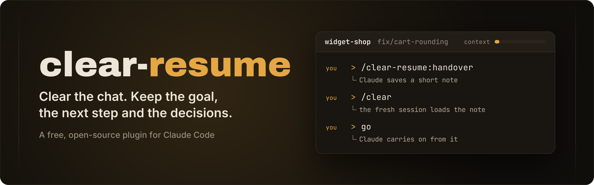
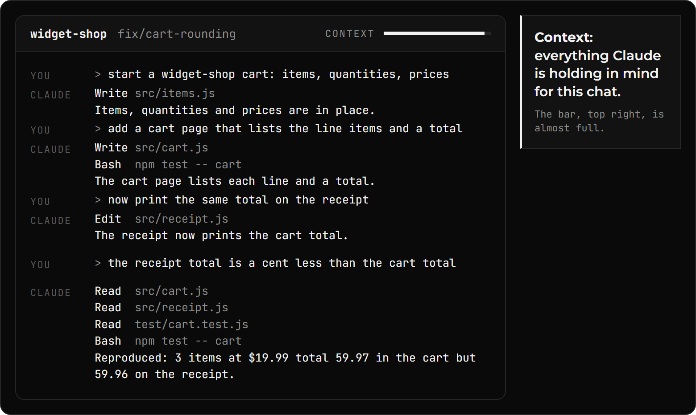
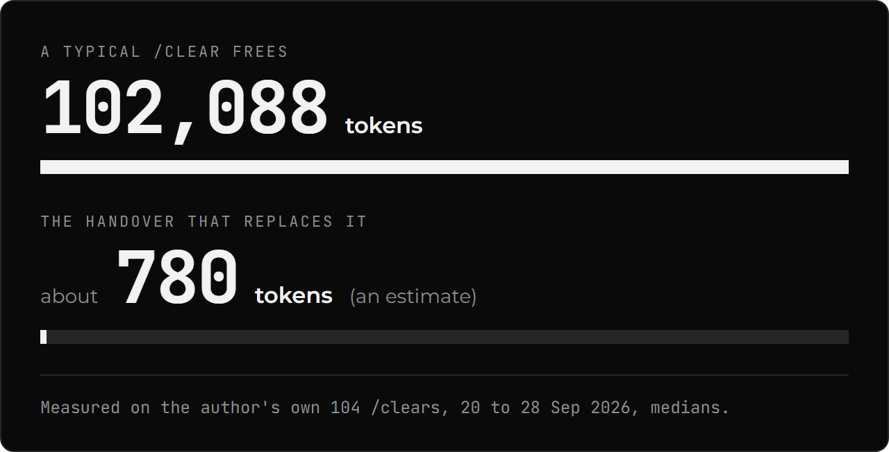
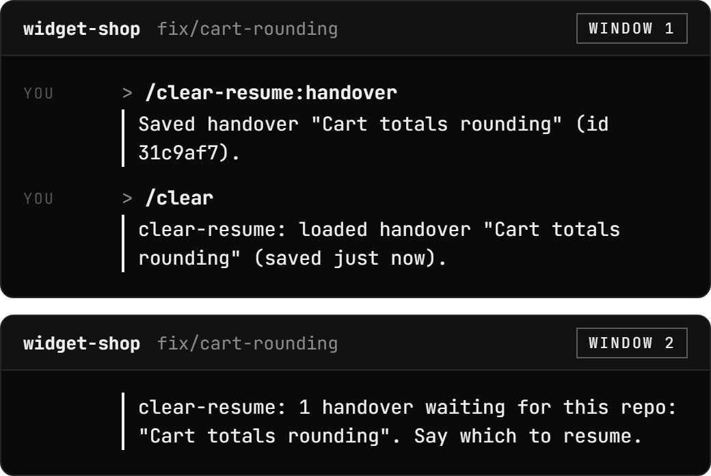
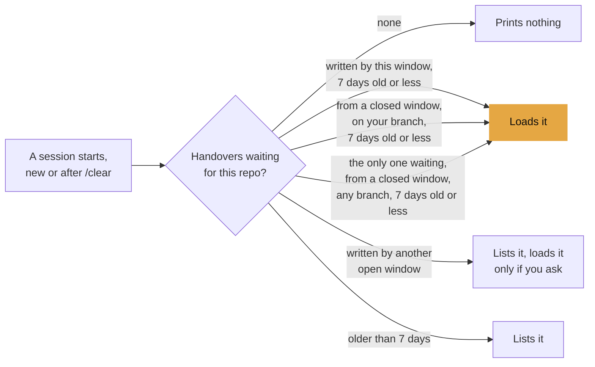
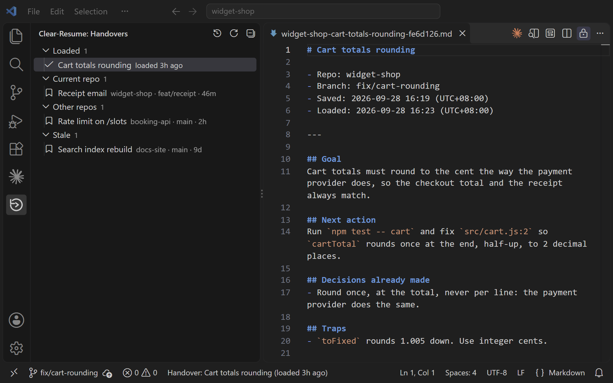
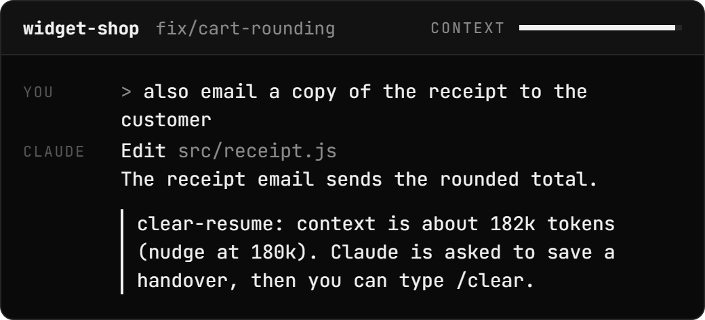

<p align="center">
  
</p>

<p align="center">
  <a href="LICENSE"></a>
  <a href="https://github.com/m4cd4r4/clear-resume/actions/workflows/test.yml"></a>
  
</p>

## The problem: long chats get slow and use up more of your plan or budget

<p align="center">
  
</p>

Claude rereads the whole context for every reply. `/compact` shrinks it to Claude's own summary, which can leave things out. `/clear` empties it, and the next session starts knowing nothing.

<details>
<summary><b>How this compares with <code>/compact</code>, <code>--resume</code> and <code>/clear</code></b></summary>
<br>

| | Claude keeps | You lose | Chat size after |
|:--|:--|:--|:--|
| `/compact` | Its own summary of the chat | What the summary leaves out | Smaller |
| `--resume` | The whole chat | Nothing | Same as before |
| `/clear` | Nothing | Everything, including where you were | Empty |
| **clear-resume** | **A short handover it wrote on purpose** | **The rest of the chat** | **Just the handover** |

</details>

## The fix: one command before `/clear`

<p align="center">
  
</p>

<p align="center"><sub>Watch the context bar, top right: full before <code>/clear</code>, almost empty after.</sub></p>

1. **Save a handover.** Type `/clear-resume:handover`. Claude reads your branch, your changes and your last few commits. Then it writes a short note about the work, called a handover: the goal, the next action, where things stand, the decisions made and what already failed. The plugin saves it and prints:

   ```text
   Saved handover "Cart totals rounding" (id 31c9af7).
   After /clear, the next session in ~/code/widget-shop loads it automatically.
   ```

2. **Clear.** Type `/clear`. The fresh session starts with the handover already loaded. The plugin's load message reads:

   ```text
   clear-resume: loaded handover "Cart totals rounding" (saved just now).
   A copy to read or share: ~/.clear-resume/loaded/widget-shop-cart-totals-rounding-31c9af7.md
   ```

   Claude Code puts `SessionStart:clear says:` in front of the first line. If you do not see the message, press <kbd>ctrl</kbd>+<kbd>o</kbd> to show it. The handover loads either way.

3. **Carry on.** Type `go`, or say what to do next. Claude carries on from the handover.

Use it when a chat has grown long and you want to `/clear`. The plugin checks for a waiting handover when a session starts, after `/clear` and after compaction (when `/compact`, or Claude Code on its own, shrinks the chat). When nothing is waiting, it prints nothing.

<p align="center"><sub>The 75-second explainer: the problem, the three steps, the numbers, two windows, the VS Code sidebar and the nudge.</sub></p>

https://github.com/user-attachments/assets/32846470-8fd4-4f25-9467-1f64a08c7efc

> [!NOTE]
> Handovers are plain text files on your disk, in `~/.clear-resume`. Nothing is sent anywhere unless you turn on [sync](docs/HOW-IT-WORKS.md#syncing-two-machines-optional) (to your own private git remote) or [web mode](docs/HOW-IT-WORKS.md#claude-code-on-the-web-opt-in) (for Claude Code on the web). Keep secrets out of them.

## The handover is under 1% of what `/clear` removes

Claude counts context in tokens. A token is a small piece of text, roughly a word.

<p align="center">
  
</p>

<p align="center"><sub>The bars are drawn to scale: 780 / 102,088 = 0.76%. The handover's size is an estimate, its characters divided by 4.</sub></p>

## Install: two commands in your terminal

> [!IMPORTANT]
> Needs **Node 18 or later** and **git**. Claude Code's native installer does not add Node, so check with `node -v`. Without Node 18 on your PATH, the plugin shows one line saying so when a session starts, and does nothing else.
>
> On Windows, Claude Code runs plugin hooks through **Git Bash**, which comes with Git for Windows.

```bash
claude plugin marketplace add https://github.com/m4cd4r4/clear-resume
claude plugin install clear-resume@clear-resume
```

Then, when a chat has grown long, type `/clear-resume:handover`, then `/clear`.

Built and used daily on Windows 11. CI runs the tests on Windows, macOS and Linux. macOS and Linux have not been tested by hand yet.

<details>
<summary><b>Update</b></summary>
<br>

Plugins from a third-party marketplace do not update on their own by default. Run both lines, then restart Claude Code:

```bash
claude plugin marketplace update clear-resume
claude plugin update clear-resume@clear-resume
```

</details>

<details>
<summary><b>Uninstall</b></summary>
<br>

```bash
claude plugin uninstall clear-resume@clear-resume
claude plugin marketplace remove clear-resume
```

Your handovers stay in `~/.clear-resume` until you delete that folder. If you added any `CLEAR_RESUME_` lines to `~/.claude/settings.json`, remove them too.

</details>

## Also built in, with no setup

<p align="center">
  
</p>

**Two Claude Code windows open on one project do not load each other's handovers.** While the window that wrote a handover is open, only that window loads it after `/clear`. Other windows on the same project list it when they start, and load it only if you ask. Once that window closes, a session on the same branch loads it. A handover older than 7 days is listed, not loaded.

<details>
<summary><b>Which handover loads when a session starts</b></summary>
<br>



These are the common cases. After compaction, only this window's own handover loads. The full order is in [Which handover loads](docs/HOW-IT-WORKS.md#which-handover-loads).

</details>

<p align="center">
  
</p>

**A copy you can read.** Each loaded handover is also saved as markdown in `~/.clear-resume/loaded/` for 30 days. Reread what a session started from, or @-mention it in another session.

## Optional: a VS Code sidebar and a nudge when the chat gets long

<p align="center">
  
</p>

**The VS Code sidebar** is a separate extension that needs the plugin. It lists your handovers by repo, with the ones loaded in the last 24 hours at the top. The status bar names the handover this workspace loaded; click it to open the copy. **Resume** opens a Claude Code tab with the handover already typed into the prompt box, not yet sent.

Search for clear-resume in the Extensions view, or run:

```bash
code --install-extension macdara.clear-resume
```

It is on the [VS Code Marketplace](https://marketplace.visualstudio.com/items?itemName=macdara.clear-resume), and on [Open VSX](https://open-vsx.org/extension/macdara/clear-resume) for VSCodium, Cursor and others.

<p align="center">
  
</p>

**The nudge** is off by default. To turn it on, add one line to the `env` block of `~/.claude/settings.json`:

```json
{ "env": { "CLEAR_RESUME_AUTO": "1" } }
```

Past 180k tokens of context (the default; `CLEAR_RESUME_NUDGE_AT` changes it), the plugin asks Claude once per session to save a handover, and prints a status line saying so. You still type `/clear` yourself: a plugin cannot run it. [Auto mode details](docs/HOW-IT-WORKS.md#auto-mode-opt-in)

> [!TIP]
> **[How it works](docs/HOW-IT-WORKS.md)** has the rest.
>
> | I want to | Read |
> |:--|:--|
> | See a whole handover | [What a handover looks like](docs/HOW-IT-WORKS.md#what-a-handover-looks-like) |
> | Find out why a handover did not load | [Troubleshooting](docs/HOW-IT-WORKS.md#troubleshooting-my-handover-did-not-load) |
> | Know which handover loads, and when | [Which handover loads](docs/HOW-IT-WORKS.md#which-handover-loads) |
> | Change a setting | [Settings](docs/HOW-IT-WORKS.md#settings) |
> | Use two machines | [Syncing two machines](docs/HOW-IT-WORKS.md#syncing-two-machines-optional) |
> | Use Claude Code on the web | [Claude Code on the web](docs/HOW-IT-WORKS.md#claude-code-on-the-web-opt-in) |
> | See what it costs, reads and writes | [Cost](docs/HOW-IT-WORKS.md#cost) and [Privacy](docs/HOW-IT-WORKS.md#privacy) |
> | See what it cannot do | [Limitations](docs/HOW-IT-WORKS.md#limitations) |

---

<p align="center">
  <a href="LICENSE">MIT licence</a>. clear-resume is an independent project. It is not made or endorsed by Anthropic.
</p>
